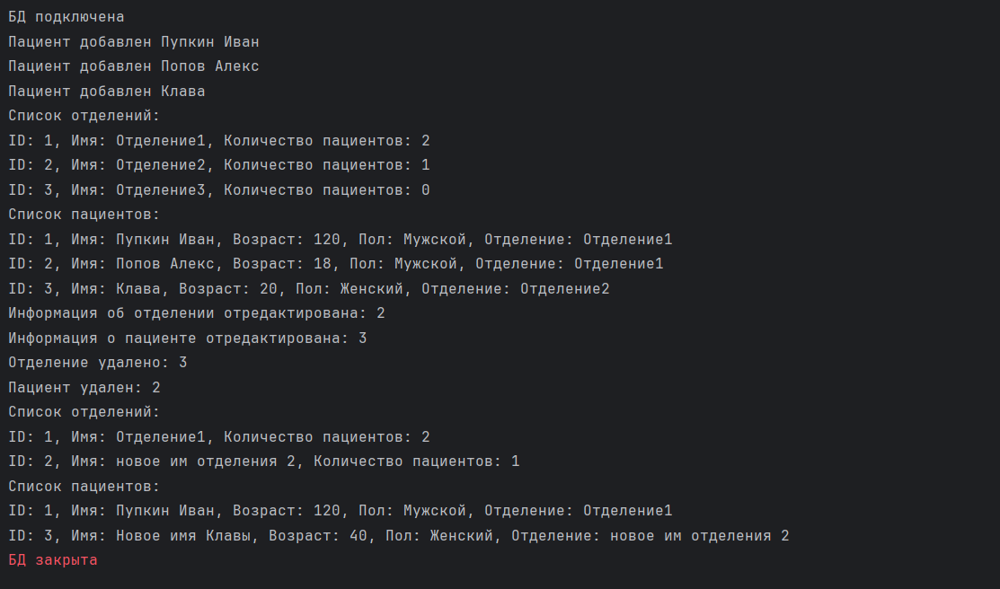

# Hospital
## Задание
Больница. Отделение: название, кол-во пациентов. Пациент: ФИо, возраст, пол. добавлять отделение/пациентов в него, удалять отделение/пациентов из него, редактирование отделения/пациентов. Добавление/удаление пациента в отделение увеличивает/уменьшает кол-во автоматически. Выводить информацию по отделениям (пациентов). Выводить информацию по пациентам (весь список с указанием отделения).
## Результат работы программы

### Результат работы программы в консоли
- 

### Результат базы данных
- 

- 
